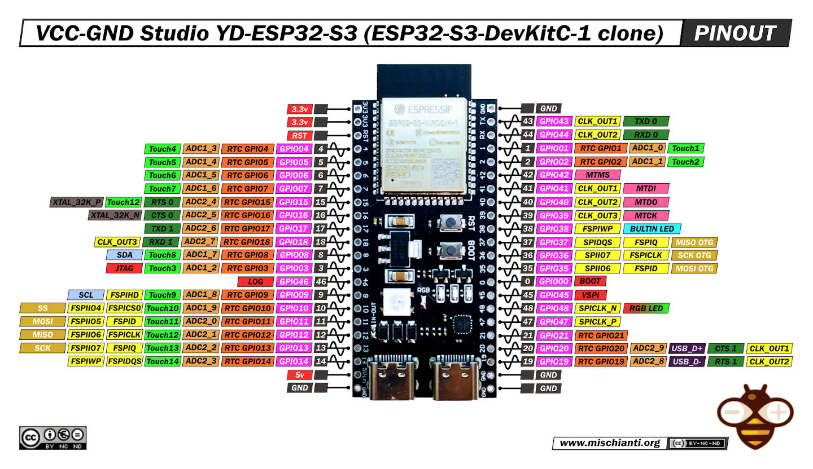
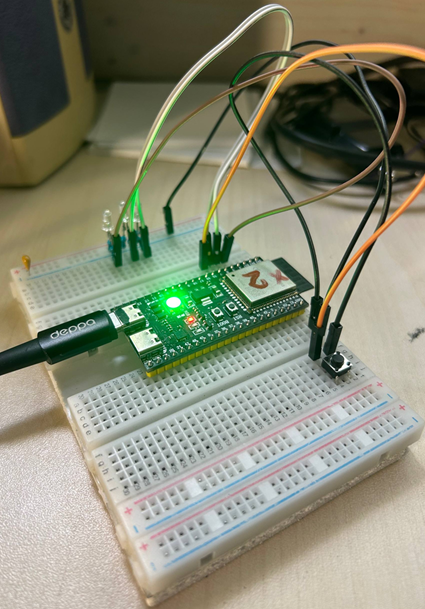

# Sber-IoT-Device
Проект на базе ESP32-S3 + FreeRTOS для получения данных с АЦП и передачи их на сервер

Полная версия задачи лежит [тут](TASK.md)
## Оборудование

Используется плата:
```
ESP32-S3-DevKitC-1 N16R8
16 MB Flash
8 MB PSRAM
USB
Wi-Fi
BLE
```

К плате подключены:

* RGB-светодиод (встроенный);
* Внешние светодиоды на GPIO (4,5,6) для отладочных целей;
* кнопка (GPIO_7);
* генератор сигнала на вход ADC - ADC1_7 (GPIO_8).

SSID и password Wi-Fi можно задаются в коде.

## Памятка - настройка и сборка проекта

```
idf.py create-project
idf.py set-target esp32s3
idf.py menuconfig
idf.py build
idf.py -p COMx flash monitor
```
## Распиновка дефкита


## Вид макетной платы

